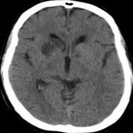
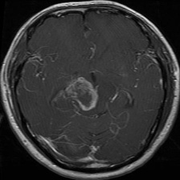
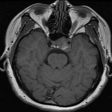

# Brain Tumor Classification using TF - CNN

This project implements a Convolutional Neural Network (CNN) using TensorFlow to classify brain MRI scans for tumor detection and classification. 

## Images

[Download dataset here](https://www.kaggle.com/datasets/masoudnickparvar/brain-tumor-mri-dataset)

## Installation & Usage
- Download the app.py and pretrained .keras model file
- update the path of the model in .py file
- open terminal and run command streamlit run app.py
- use train.ipynb to experiment with the training. 
